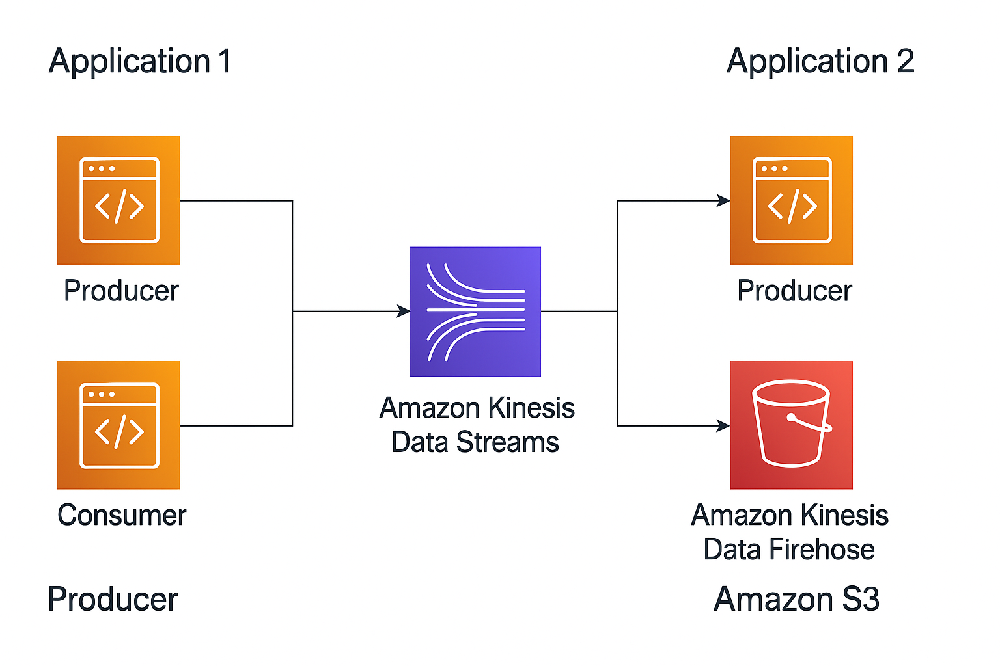
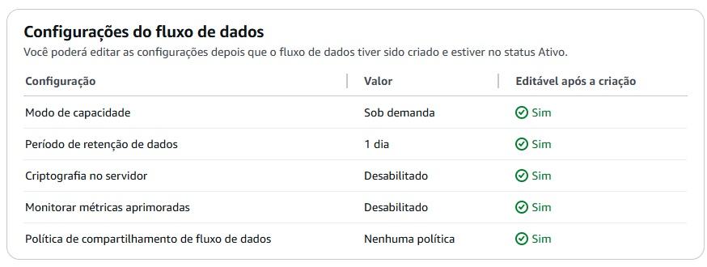
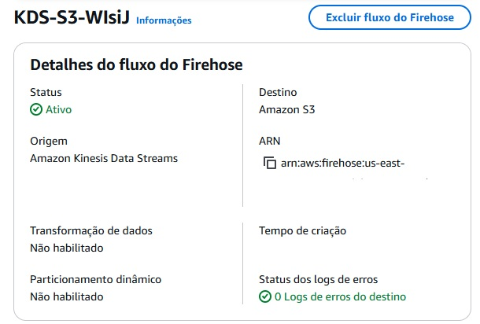

# Projeto de Streaming com AWS Kinesis e Python

Este projeto demonstra duas abordagens diferentes para ingestão de dados em tempo real usando AWS Kinesis:

- **Kinesis Streams + Consumidor Python**
- **Kinesis Streams + Firehose + Entrega automática para S3**

## 🧪 Casos de Uso

1. Produção e consumo de eventos diretamente via Streams.
2. Produção de eventos via Streams que são posteriormente entregues ao S3 via Firehose.

## 🚀 Tecnologias

- Python
- AWS Kinesis (Streams, Firehose)
- AWS S3
- boto3
- dotenv

## 🎯 Objetivo

Desenvolver um pipeline de ingestão e processamento de dados em tempo real utilizando AWS, com foco na comparação entre Kinesis Streams e Kinesis Firehose:

1. **Produtor (Python)** envia dados no formato JSON para um Kinesis Stream.
2. **Consumidor (Python)** lê os dados diretamente do Stream, aplica lógica de deduplicação e simula processamento em tempo real.
3. **Firehose** consome dados do Stream e realiza a entrega automática em um bucket S3.
4. Os dados armazenados no S3 podem ser utilizados posteriormente para análises, cargas em Data Lakes ou integrações com ferramentas de BI.

O projeto também permite observar as diferenças de latência e comportamento entre Streams e Firehose.

Segue esquema do projeto:


## 📁 Estrutura

```bash
aws-kinesis-streaming-case/
│
├── producer_stream/ -> Produtor que envia para Kinesis Stream
├── consumer_stream/ -> Consumidor Python do Stream
├── producer_firehose/ -> Produtor que envia para Firehose (via Stream)
```

## Como executar

### 1. Instale as dependências.

```bash
pip install -r requirements.txt
```

### 2. Configure o arquivo .env

Disponibilizei como deve ser feito com .env.example
```
AWS_ACCESS_KEY_ID=SUAS_CHAVES_AQUI
AWS_SECRET_ACCESS_KEY=SUA_CHAVE_SECRETA
AWS_REGION=us-east-1
```

### 3. Configure o Kinesis Streams e Kinesis Firehose
Segue imagens:
1. Streams  

2. Firehose  


### 4. Execute os Scripts

 - Para enviar dados ao Kinesis Stream:
   ```bash
   python awskinesis_produtor.py
   ```

- Para escutar os dados com o consumidor Python:
     ```bash
     python awskinesis_consumidor.py
     ```
- Para enviar dados ao Firehose + S3:
       ```bash
       python produtorkinesisfirehose.py
       ```

### 5. Streams Vs. Firehose
```
| Característica | Kinesis Data Streams           | Kinesis Firehose                 |
| -------------- | ------------------------------ | -------------------------------- |
| Entrega        | Near real-time (milissegundos) | Bufferizado (entrega em batchs)  |
| Destino        | Consumidor personalizado       | S3, Redshift, Elasticsearch, etc |
| Controle       | Mais flexível e granular       | Mais automatizado                |
| Complexidade   | Requer gerenciar consumidores  | Entrega automática               |
```
  

### 6. Segurança

As credenciais AWS são carregadas via .env (e este arquivo está no .gitignore).


### 7. Referências

[AWS Kinesis Documentation](https://docs.aws.amazon.com/kinesis)  
[AWS Firehose](https://docs.aws.amazon.com/firehose/latest/dev/what-is-this-service.html)  
[boto3 Documentação](https://boto3.amazonaws.com/v1/documentation/api/latest/index.html)

